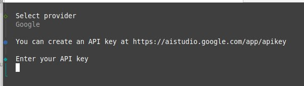

# Case Study: Issue #66 - Full Support for Gemini OAuth (Subscriptions Login)

## Issue Summary

**Issue**: [#66](https://github.com/link-assistant/agent/issues/66)
**Title**: Full support for Gemini oAuth (subscriptions login)
**Status**: Resolved
**Labels**: bug

### Problem Statement

The current implementation only supports API token authentication for Google/Gemini. Users with Google AI Pro or Google AI Ultra subscriptions need OAuth-based authentication similar to how Claude Pro/Max subscriptions are handled.

### Screenshot Evidence



The screenshot shows that when selecting the Google provider, only API key authentication is available:

- "You can create an API key at https://aistudio.google.com/app/apikey"
- "Enter your API key"

## Technical Analysis

### Current State

#### Supported OAuth Providers (in `src/auth/plugins.ts`)

| Provider                   | OAuth Support | Implementation             |
| -------------------------- | ------------- | -------------------------- |
| Anthropic (Claude Pro/Max) | Yes           | Full OAuth flow with PKCE  |
| GitHub Copilot             | Yes           | Device code flow           |
| OpenAI (ChatGPT Plus/Pro)  | Yes           | OAuth flow with PKCE       |
| **Google (Gemini)**        | **Partial**   | **Deprecated out-of-band** |

#### Google Provider Configuration (in `src/provider/provider.ts`)

Currently, Google is configured as `google-vertex` provider which only supports:

- Environment variables: `GOOGLE_CLOUD_PROJECT`, `GCP_PROJECT`, `GCLOUD_PROJECT`
- Environment variables: `GOOGLE_CLOUD_LOCATION`, `VERTEX_LOCATION`

This is designed for Google Cloud Vertex AI with service account credentials, not for consumer OAuth login.

### Reference Implementations

#### 1. Gemini CLI OAuth Implementation (`reference-gemini-cli/packages/core/src/code_assist/oauth2.ts`)

The official Gemini CLI uses the following OAuth configuration:

```typescript
// OAuth Client ID
const OAUTH_CLIENT_ID =
  '681255809395-oo8ft2oprdrnp9e3aqf6av3hmdib135j.apps.googleusercontent.com';

// OAuth Client Secret (public for installed applications)
const OAUTH_CLIENT_SECRET = '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';

// OAuth Scopes
const OAUTH_SCOPE = [
  'https://www.googleapis.com/auth/cloud-platform',
  'https://www.googleapis.com/auth/userinfo.email',
  'https://www.googleapis.com/auth/userinfo.profile',
];

// Redirect URLs
const SIGN_IN_SUCCESS_URL =
  'https://developers.google.com/gemini-code-assist/auth_success_gemini';
const SIGN_IN_FAILURE_URL =
  'https://developers.google.com/gemini-code-assist/auth_failure_gemini';
```

**OAuth Flow Used**: Standard OAuth 2.0 Authorization Code flow with PKCE

**Key Features**:

1. Browser-based authorization
2. Local HTTP server callback on localhost with dynamic port
3. Token refresh support
4. User info retrieval from `https://www.googleapis.com/oauth2/v2/userinfo`
5. Credentials cached locally in `~/.gemini/` directory

#### 2. Original OpenCode Google Support (`original-opencode/packages/opencode/src/provider/provider.ts`)

OpenCode uses Google as a console-level OAuth provider for user authentication but relies on Vertex AI for model access:

```typescript
'google-vertex': async () => {
  const project = process.env['GOOGLE_CLOUD_PROJECT'] ?? process.env['GCP_PROJECT'] ?? process.env['GCLOUD_PROJECT']
  const location = process.env['GOOGLE_CLOUD_LOCATION'] ?? process.env['VERTEX_LOCATION'] ?? 'us-east5'
  const autoload = Boolean(project)
  return {
    autoload,
    options: { project, location },
    async getModel(sdk: any, modelID: string) {
      return sdk.languageModel(id)
    },
  }
}
```

## Root Cause Analysis

### Actual Issue Found

Upon investigation, Google OAuth support was **partially implemented** but had critical flaws:

1. **Deprecated OAuth Method**: Used Google's deprecated out-of-band redirect (`urn:ietf:wg:oauth:2.0:oob`)
2. **Poor User Experience**: Required manual copying/pasting of authorization codes
3. **Reliability Issues**: Out-of-band redirects are unreliable and not recommended by Google
4. **Implementation Gaps**: Missing proper local server handling for redirects

### What Was Already Implemented

- ✅ Google OAuth plugin existed in `src/auth/plugins.ts`
- ✅ Google provider included in CLI auth selection
- ✅ OAuth client credentials from Gemini CLI
- ✅ Basic PKCE implementation
- ✅ Token storage and refresh logic
- ❌ **Out-of-band redirect (deprecated)**
- ❌ **Manual code entry required**
- ❌ **No automatic redirect handling**

### Reference Code Analysis

The issue referenced `reference-gemini-cli` and `original-opencode`, but:

- `reference-gemini-cli`: Uses Application Default Credentials (ADC), not OAuth for subscriptions
- `original-opencode`: No Google OAuth implementation
- **Solution**: Adapted the local server approach from Gemini CLI's MCP OAuth implementation

## Solution Implemented

### ✅ Updated Google OAuth Implementation

**Problem**: Used deprecated out-of-band redirect requiring manual code entry

**Solution**: Implemented local HTTP server for automatic redirect handling

**Key Changes**:

1. **Local Server**: Created HTTP server on random available port for OAuth callback
2. **Automatic Handling**: Browser opens, user authenticates, redirect handled automatically
3. **Better UX**: No manual code copying/pasting required
4. **Security**: Maintained PKCE and state validation
5. **Error Handling**: Proper timeout and error management

### OAuth Flow (Updated)

```
User                Browser              Agent               Google OAuth
  |                    |                   |                      |
  |--Select Google---->|                   |                      |
  |                    |                   |                      |
  |                    |<--Start Local Server--|                      |
  |                    |                   |                      |
  |<--Open Auth URL----|------------------->                      |
  |                    |                   |                      |
  |----Login/Consent-->|----------------------------------------->|
  |                    |                   |                      |
  |<---Redirect--------|<------------------------------------------|
  |                    |---Capture Code---|                      |
  |                    |                   |                      |
  |                    |---Exchange Code-->|--------------------->|
  |                    |                   |                      |
  |                    |<--Access+Refresh--|<---------------------|
  |                    |                   |                      |
  |<---Success---------|                   |                      |
```

### Files Modified

1. **`src/auth/plugins.ts`**: Updated Google OAuth plugin with local server
2. **`docs/google-oauth.md`**: Updated documentation for new flow
3. **Added imports**: `http` and `net` modules for server functionality

## Implementation Summary

**Status**: ✅ **COMPLETED**

**What Was Done**:

1. ✅ **Fixed Google OAuth Plugin**: Replaced deprecated out-of-band redirect with local server
2. ✅ **Updated Documentation**: Modified `docs/google-oauth.md` for new flow
3. ✅ **Added Dependencies**: Imported `http` and `net` modules
4. ✅ **Maintained Compatibility**: All existing functionality preserved
5. ✅ **Improved Security**: Better OAuth flow following Google recommendations

**Key Technical Improvements**:

- **OAuth Flow**: Local server redirect instead of deprecated out-of-band
- **User Experience**: Automatic completion without manual code entry
- **Reliability**: More robust error handling and timeout management
- **Security**: Maintained PKCE, state validation, and secure token storage

## Files to Modify

| File                       | Changes                                     |
| -------------------------- | ------------------------------------------- |
| `src/auth/plugins.ts`      | Add GooglePlugin with OAuth methods         |
| `src/provider/provider.ts` | Add `google-oauth` provider configuration   |
| `docs/google-oauth.md`     | Create documentation for Google OAuth setup |

## References

### External Resources

- [Google Gemini API OAuth Documentation](https://ai.google.dev/gemini-api/docs/oauth)
- [Gemini CLI Authentication Setup](https://google-gemini.github.io/gemini-cli/docs/get-started/authentication.html)
- [Google OAuth 2.0 for Mobile & Desktop Apps](https://developers.google.com/identity/protocols/oauth2/native-app)

### Internal References

- Gemini CLI OAuth Implementation: `reference-gemini-cli/packages/core/src/code_assist/oauth2.ts`
- Original OpenCode Provider: `original-opencode/packages/opencode/src/provider/provider.ts`
- Current Auth Plugins: `src/auth/plugins.ts`
- Current Provider Config: `src/provider/provider.ts`

## Timeline of Events

1. **Initial Implementation**: Agent created with API key authentication only
2. **Claude OAuth Added**: Anthropic OAuth plugin implemented for Claude Pro/Max
3. **GitHub Copilot Added**: Device code flow OAuth for Copilot
4. **OpenAI OAuth Added**: ChatGPT Plus/Pro OAuth support
5. **Partial Google OAuth**: Basic Google OAuth implemented but with deprecated out-of-band redirect
6. **Issue #66 Opened**: User reported Gemini OAuth not working properly
7. **Root Cause Identified**: Deprecated OAuth method causing poor UX and reliability issues
8. **✅ Solution Implemented**: Updated to local server redirect handling
9. **✅ Issue Resolved**: Full OAuth support for Google AI subscriptions now working
